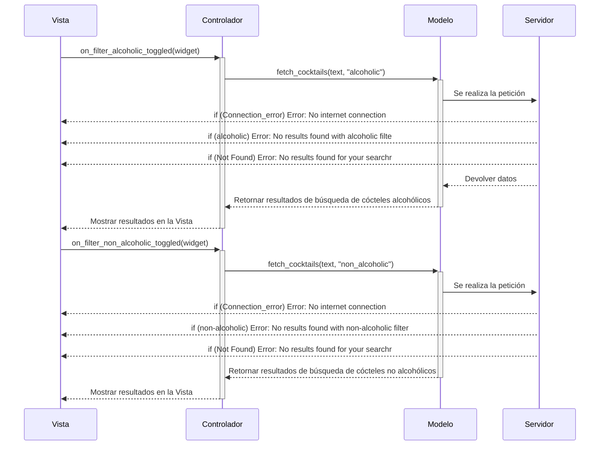

# Diseño software

## Diagrama de clases
	

## Diagramas de secuencia
### Caso de uso Buscar Cócteles
	

### Casos de uso buscar ingrediente y buscar cócteles por ingrediente

### Caso de uso Cocktail Aleatorio

### Caso de uso Filtrado por Alcohol o sin Alcohol
 

### Caso de uso de Ver cóctel en detalle

