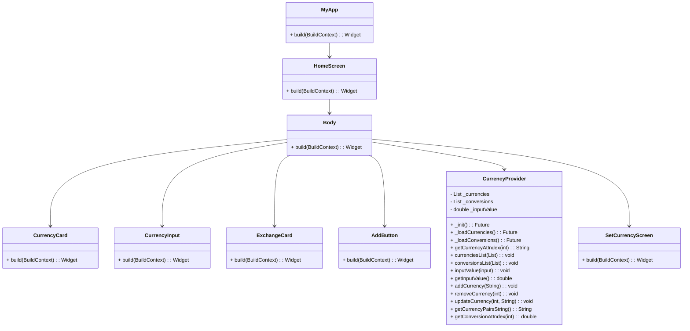
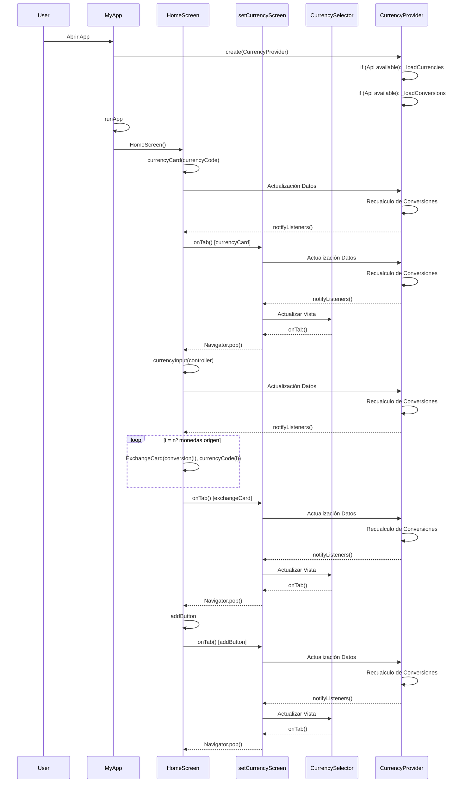
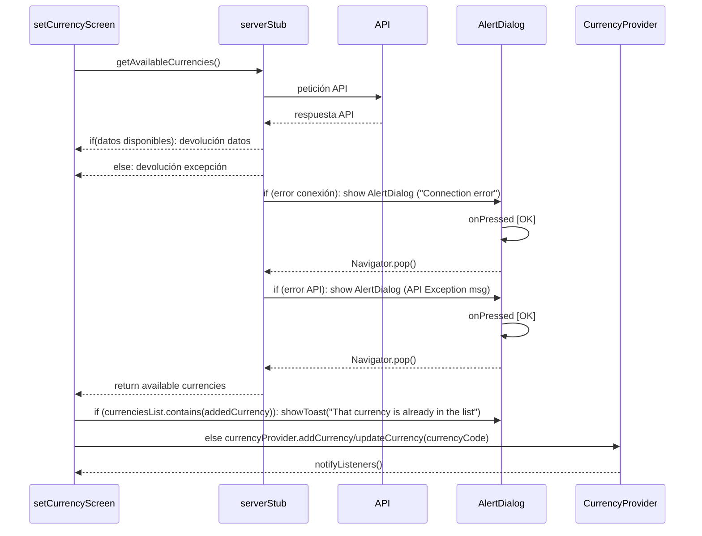

# Diseño software

## Diagrama estático

```mermaid
classDiagram
    class   MyApp{
        + build(BuildContext) : Widget
    }
    class   HomeScreen{
        + build(BuildContext) : Widget
    }
    class   Body{
        + build(BuildContext) : Widget
    }
    class CurrencyProvider{
        - List<Currency> _currencies
        - List<double> _conversions
        - double _inputValue

        + _init(): Future<void>
        + _loadCurrencies() : Future<void>
        + _loadConversions() : Future<void>
        + getCurrencyAtIndex(int) : String 
        + currenciesList(List<String>) : void
        + conversionsList(List<double>) : void
        + inputValue(input) : void
        + getInputValue() : double
        + addCurrency(String) : void
        + removeCurrency(int) : void
        + updateCurrency(int, String) : void
        + getCurrencyPairsString() : String
        + getConversionAtIndex(int) : double
    }
    class SetCurrencyScreen{
        + build(BuildContext) : Widget
    }
    class AddButton{
        + build(BuildContext) : Widget
    }
    class CurrencyCard{
        + build(BuildContext) : Widget
    }
    class CurrencyInput{
        + build(BuildContext) : Widget
    }
    class ExchangeCard{
        + build(BuildContext) : Widget
    }

    MyApp --> HomeScreen
    HomeScreen --> Body
    Body --> CurrencyCard
    Body --> CurrencyInput
    Body --> ExchangeCard
    Body --> AddButton
    Body --> CurrencyProvider
    Body --> SetCurrencyScreen
```

## Diagrama dinámicos

### Caso de uso general

```mermaid
sequenceDiagram
  participant User
  participant MyApp
  participant HomeScreen
  participant setCurrencyScreen  
  participant CurrencySelector
  participant CurrencyProvider


  User->>MyApp: Abrir App
  MyApp->>CurrencyProvider: create(CurrencyProvider)
  CurrencyProvider->>CurrencyProvider: if (Api available): _loadCurrencies
  CurrencyProvider->>CurrencyProvider: if (Api available): _loadConversions
  MyApp->>MyApp: runApp
  MyApp->>HomeScreen: HomeScreen()

  HomeScreen->>HomeScreen: currencyCard(currencyCode)

  HomeScreen->>CurrencyProvider: Actualización Datos
  CurrencyProvider->>CurrencyProvider: Recualculo de Conversiones
  CurrencyProvider-->>HomeScreen: notifyListeners()

  HomeScreen->>setCurrencyScreen: onTab() [currencyCard]
  setCurrencyScreen->>CurrencyProvider: Actualización Datos
  CurrencyProvider->>CurrencyProvider: Recualculo de Conversiones
  CurrencyProvider-->>setCurrencyScreen: notifyListeners()
  setCurrencyScreen->>CurrencySelector: Actualizar Vista
  CurrencySelector-->>setCurrencyScreen: onTab()
  setCurrencyScreen-->>HomeScreen:Navigator.pop()

  HomeScreen->>HomeScreen: currencyInput(controller)
  HomeScreen->>CurrencyProvider: Actualización Datos
  CurrencyProvider->>CurrencyProvider: Recualculo de Conversiones
  CurrencyProvider-->>HomeScreen: notifyListeners()
  
  loop i = nº monedas origen
    HomeScreen->>HomeScreen: ExchangeCard(conversion(i), currencyCode(i))
  end
  HomeScreen->>setCurrencyScreen: onTab() [exchangeCard]
  setCurrencyScreen->>CurrencyProvider: Actualización Datos
  CurrencyProvider->>CurrencyProvider: Recualculo de Conversiones
  CurrencyProvider-->>setCurrencyScreen: notifyListeners()
  setCurrencyScreen->>CurrencySelector: Actualizar Vista
  CurrencySelector-->>setCurrencyScreen: onTab()
  setCurrencyScreen-->>HomeScreen:Navigator.pop()

  HomeScreen->>HomeScreen: addButton
  HomeScreen->>setCurrencyScreen: onTab() [addButton]
  setCurrencyScreen->>CurrencyProvider: Actualización Datos
  CurrencyProvider->>CurrencyProvider: Recualculo de Conversiones
  CurrencyProvider-->>setCurrencyScreen: notifyListeners()
  setCurrencyScreen->>CurrencySelector: Actualizar Vista
  CurrencySelector-->>setCurrencyScreen: onTab()
  setCurrencyScreen-->>HomeScreen:Navigator.pop()

```

### Especificación de setCurrencyScreen

```mermaid
sequenceDiagram

  participant setCurrencyScreen  
  participant serverStub
  participant API
  participant AlertDialog
  participant CurrencyProvider


  setCurrencyScreen->>serverStub: getAvailableCurrencies()
  serverStub->>API: petición API
  API-->>serverStub: respuesta API
  serverStub-->>setCurrencyScreen: if(datos disponibles): devolución datos
  serverStub-->>setCurrencyScreen: else: devolución excepción
  serverStub->>AlertDialog: if (error conexión): show AlertDialog ("Connection error")
  AlertDialog->>AlertDialog: onPressed [OK]
  AlertDialog-->>serverStub: Navigator.pop()
  serverStub->>AlertDialog: if (error API): show AlertDialog (API Exception msg)
  AlertDialog->>AlertDialog: onPressed [OK]
  AlertDialog-->>serverStub: Navigator.pop()
  serverStub-->>setCurrencyScreen: return available currencies
  setCurrencyScreen->>AlertDialog: if (currenciesList.contains(addedCurrency)): showToast("That currency is already in the list")
  setCurrencyScreen->>CurrencyProvider: else currencyProvider.addCurrency/updateCurrency(currencyCode);
  CurrencyProvider-->>setCurrencyScreen: notifyListeners()


  


```